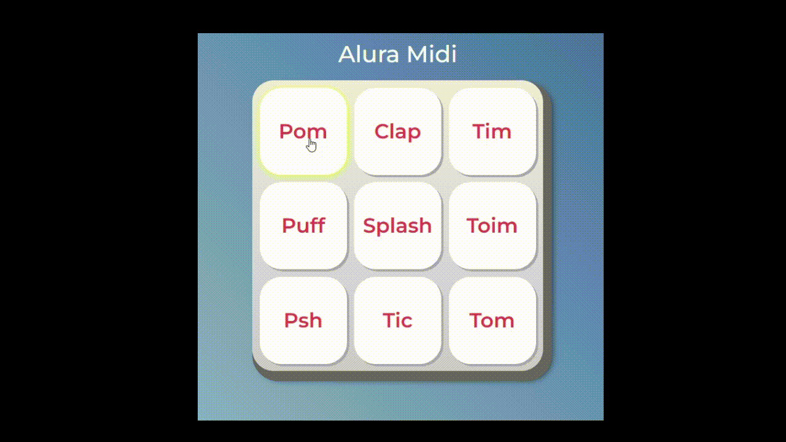

# [Alura MIDI](alura-midi-nu-puce.vercel.app/)

## 🎵 Sobre o projeto:
O alura MIDI é um teclado musical virtual desenvolvido durante o curso da Alura.
A ideia é simples e diverida: cada tecla reproduz um som diferente, permitindo que você crie suas próprias batidas direto no navegador!

Esse projeto foi feito para treinar:
📌 Manipulação de **DOM com JavaScript**
📌 Uso de **eventos de teclado e clique**
📌 Estruturação com **HTML5** e estilização com **CSS3**

---

## 🚀 Tecnologias utilizadas:
- **HTML5**: estrutura do projeto
- **CSS3**: estilo e responsividade
- **JavaScript**: lógica e interação

---

## 🎹 Como funciona?
1. Abra o projeto no navegador
2. Clique nos botões ou use o teclado (**Enter** ou **Space**) para ativar os sons
3. Experimente criar um ritmo só seu

---



---

## 📂 Como rodar o projeto:

```bash
# Clone o repositório
git clone https://github.com/UelintonHJ/alura-midi.git

# Entre na pasta do projeto
cd alura-midi

#Abra o arquivo index.html no navegador
```
